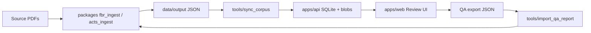

# Unified FBR Corpus Platform (crx)

## Verdict

Build **one product** in `[/Users/muhammad.husnain/Downloads/code/crx](/Users/muhammad.husnain/Downloads/code/crx)`: the QA portal and the PDF→JSON pipeline share a repo, CLI, and Docker stack. Copy and reorganize working code; do **not** rewrite `fbr_ingest` / `acts_ingest` internals in v1 (legal text fidelity risk). Live site [pdf-qa-portal.vercel.app](https://pdf-qa-portal.vercel.app/) is empty today — local seed from existing `output/` JSON is the first win.

## Target layout

```
crx/
├── README.md
├── docker-compose.yml          # api + web (+ optional worker later)
├── .env.example
├── pyproject.toml              # ruff + pytest paths; PYTHONPATH covers packages
├── Makefile                    # up, sync, convert, test, seed
├── apps/
│   ├── api/                    # from PDF-QA-Portal/backend
│   └── web/                    # from PDF-QA-Portal/frontend
├── packages/
│   ├── fbr_ingest/             # Ordinance pipeline (copy)
│   └── acts_ingest/            # Acts + OCR fork (copy; keep separate)
├── tools/                      # convert_*, run_tests, audit_*, sync_corpus, import_qa
├── data/                       # gitignored: db, uploads, corpora mounts, output
└── docs/                       # slim ops + architecture (not aspirational design dump)
```

Remove the empty `[Untitled/](/Users/muhammad.husnain/Downloads/code/crx/Untitled)` stub; init git at `crx/` root.

## Data flow (product glue)




## Phase 1 — Scaffold and run (priority)

1. **Copy portal** code into `apps/api` + `apps/web` (strip local `data/`, `uploads/`, `.venv`, `node_modules`, huge Assets). Adjust imports/`PYTHONPATH` so `uvicorn apps.api.main:app` (or keep `backend` package name via path layout — prefer renaming package to `api` only if cheap; otherwise keep `backend` module name under `apps/api` to avoid a mass rename).
2. **Copy pipeline** packages + scripts into `packages/` + `tools/` (no PDFs, no `.ocrcache`, no session dumps). Keep Ordinance vs Acts as two packages.
3. **Docker Compose**: API (prod-ish uvicorn), Web (Vite for now, matching current portal), volumes for `data/db` + `data/uploads`. Mount read-only corpus paths from CC-FBR / Acts_fbr via compose override or `CORPUS_`* env so we do not duplicate multi-GB PDFs into git.
4. **Unified sync**: one `make sync` wrapping existing `sync_acts` for both Ordinance root and `Acts_fbr`, with `--metrics`.
5. **Seed locally**: sync from existing JSON in CC-FBR `output/` so the dashboard is non-empty (unlike production today).
6. **Smoke**: `/health`, list documents, open one review page, pytest + frontend build.

## Phase 2 — Migrations and ops hygiene

1. Replace ad-hoc `ALTER` try/except with a small **versioned migration runner** in the API (`schema_version` table + ordered SQL/Python migrations). Port current `[database.py](/Users/muhammad.husnain/Downloads/code/AG/PDF-QA-Portal/backend/database.py)` DDL into `0001_initial`, keep boot behavior idempotent.
2. Add `[.env.example](/Users/muhammad.husnain/Downloads/code/crx/.env.example)`: `DATABASE_PATH`, `UPLOAD_DIR`, `CORPUS_ORDINANCE`, `CORPUS_ACTS`, Vite URLs, OCR cache path.
3. Root `Makefile` / docs: `make up`, `make sync`, `make convert-ordinance PDF=…`, `make convert-acts …`, `make test`, `make export-qa`.
4. Production web image: static Vite build served by nginx or FastAPI static mount (fix current “Vite-in-Compose” for deploy path). Keep Vercel-compatible SPA rewrite if needed.

## Phase 3 — Product features that justify “revamp”

Ship these as thin glue on top of proven code (not a UI redesign for its own sake):

1. **Corpus control in the portal**: dashboard actions / API routes to “sync from configured corpus”, show last sync time, pipeline health badges (already partially there via metrics).
2. **Replace-JSON / version workflow** stays first-class; document convert → sync → review → export → `import_qa_report` in README as the closed loop.
3. **Empty-state and branding**: dashboard that explains seed/sync when 0 docs (live site currently spins on empty corpus).
4. Soft polish only: keep React/Zustand/CSS; no TypeScript rewrite, no auth (still 2–3 trusted reviewers), CORS remains local-dev friendly with a note for public deploy.

## Explicit non-goals (v1)

- Merging `fbr_ingest` and `acts_ingest` into one package (drift risk; OCR fork is intentional).
- Re-converting the full 80+ Acts corpus inside this session.
- Copying multi-GB PDFs or portal DB blobs into git.
- Adding LLM/vision into the conversion path.
- Rewriting the live Vercel deploy unless requested after local stack is solid.

## Execution cadence (`/loop`)

After plan approval: implement Phase 1 immediately, then arm a **fixed 10m loop** that re-checks Compose health, sync document counts, and failing tests until the stack is green—or stop on request. Each tick: short status of what changed.

## Success criteria

- `docker compose up` → UI + API healthy.
- `make sync` loads Ordinance (12) + Acts (~80) editions into SQLite with PDFs resolvable.
- Review page: PDF + HTML side-by-side for at least one Ordinance and one Act.
- `pytest` (api) + pipeline `run_tests` smoke + `npm run build` pass.
- README documents convert → sync → review → QA import in one place.

